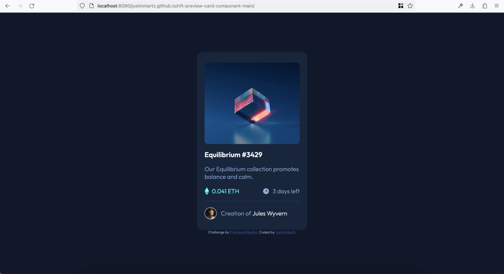

# Frontend Mentor - NFT preview card component solution

This is a solution to the [NFT preview card component challenge on Frontend Mentor](https://www.frontendmentor.io/challenges/nft-preview-card-component-SbdUL_w0U). Frontend Mentor challenges help you improve your coding skills by building realistic projects. 

## Table of contents

- [Overview](#overview)
  - [The challenge](#the-challenge)
  - [Screenshot](#screenshot)
  - [Links](#links)
- [My process](#my-process)
  - [Built with](#built-with)
  - [What I learned](#what-i-learned)
  - [Continued development](#continued-development)
- [Author](#author)

## Overview

### The challenge

Users should be able to:

- View the optimal layout depending on their device's screen size
- See hover states for interactive elements

### Screenshot

### Links

- Solution URL: [https://github.com/JustinMartz/nft-preview-card-component-main](https://github.com/JustinMartz/nft-preview-card-component-main)
- Live Site URL: [https://justinmartz.github.io/nft-preview-card-component-main/](https://justinmartz.github.io/nft-preview-card-component-main/)

## My process

### Built with

- Semantic HTML5 markup
- Flexbox
- Mobile-first workflow

### What I learned

I learned much more about the span element with this challenge. I also became more comfortable with Flexbox.

### Continued development

With every challenge I find that I still don't know as much fundamental HTML and CSS as I'd like. So I'll keep reading up on the basics.

## Author

- Website - [Justin Martz on GitHub Pages](https://justinmartz.github.io)
- Frontend Mentor - [@JustinMartz](https://www.frontendmentor.io/profile/JustinMartz)